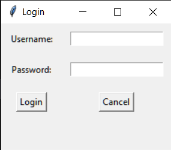
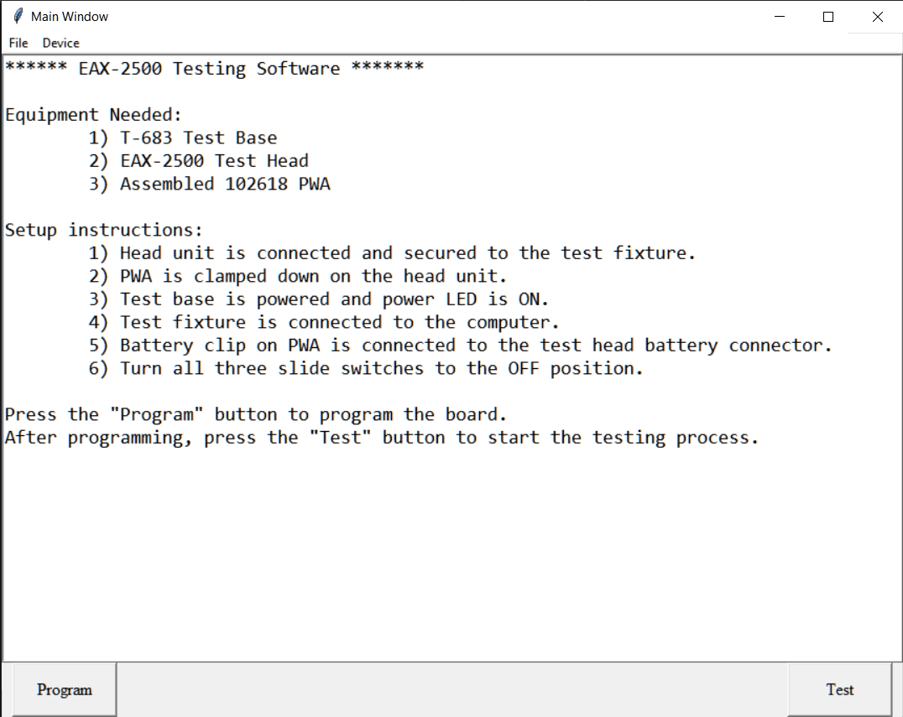

# EAX-500 Tkinter GUI

This is a GUI for the *EAX-500*. It is written in Python and uses the Tkinter library. It is designed to be used with the *EAX-500*

## Installation

1. Install [Python 3.7+]
2. Clone this repository
3. Install the python requirements by running `pip install -r requirements.txt` in the repository directory
4. This project uses [pyfirmata4] to communicate with the *EAX-500* over USB. This can be installed by running `pip install pyfirmata4`
5. Run `pipenv install` in the repository directory
6. Run `python eax500.py` to start the GUI

### Building

1. Install [PyInstaller]
2. Run `pyinstaller eax500.py` in the repository directory
3. The executable will be in the `dist` directory
4. Run `pyinstaller eax500.py --onefile` to build a single executable
5. Run `pyinstaller eax500.py --onefile --windowed` to build a single executable without a console window
6. Run `pyinstaller eax500.py --onefile --windowed --icon=eax500.ico` to build a single executable without a console window and with an icon

### Screenshots

### License

This project is licensed under the MIT License - see the [LICENSE] file for details

### TODO

- [x] Add USB functionality
- [ ] Add a status bar
- [ ] Add a toolbar
- [x] Add preferences
- [ ] Add a help dialog
- [x] Set the window font
- [ ] Add device selection
- [x] Add test speed slider
- [ ] Add font selection
